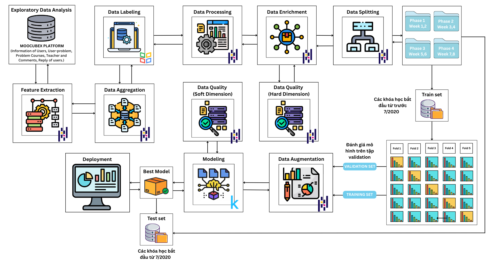
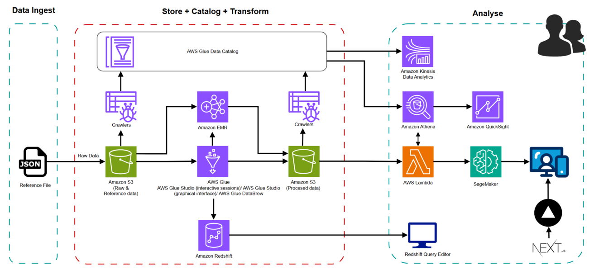
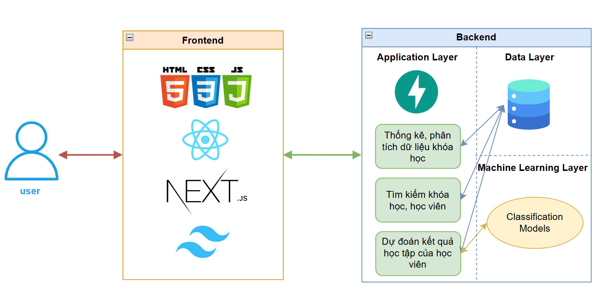

<!-- Banner -->
<p align="center">
  <a href="https://www.uit.edu.vn/" title="Trường Đại học Công nghệ Thông tin" style="border: none;">
    
  </a>
</p>

---

# <p align="center">**EARLY PREDICTION OF STUDENT PERFORMANCE IN MOOCs USING GRAPH-BASED RELATIONAL FEATURE ENRICHMENT**</p>

## <p align="center">**CS313 — DATA MINING AND APPLICATIONS**</p>

<p align="center">
  <a href="https://bi-moocubex-frontend.vercel.app/"></a>
  &nbsp;
  
  &nbsp;
  
</p>

---

## 📝 Giới thiệu

Dự án xây dựng hệ thống **dự đoán sớm** (early prediction) kết quả cuối khóa của học viên trong các khóa học trực tuyến mở (MOOCs).  
Trọng tâm là **làm giàu đặc trưng quan hệ dựa trên đồ thị** (graph-based relational feature enrichment) — kết hợp:
- **Đặc trưng đồ thị truyền thống** (centrality, clustering, degree, cluster membership, …)
- **Embedding đồ thị** bằng **node2vec**

Những đặc trưng này được hòa trộn với tín hiệu hành vi (user–video, user–problem, forum comment/reply, metadata course…) theo **phase (tuần)** để huấn luyện nhiều họ mô hình. Hệ thống hướng tới:
- **Cảnh báo sớm** nhóm học viên có nguy cơ không đạt mục tiêu
- **Hỗ trợ giảng viên/quản trị** theo dõi lớp, điều chỉnh tài nguyên và can thiệp kịp thời
- **Trải nghiệm tra cứu & trực quan** qua **Frontend Demo**.

---

## ✨ Điểm nổi bật & Tính năng chính

- **Early Prediction theo giai đoạn học**: dự đoán trên dữ liệu các **phase 1→4** (tuần 1–8), tách **k-fold** để đánh giá ổn định.
- **Làm giàu đặc trưng quan hệ**:
  - Classic graph features + **node2vec embeddings** trên đồ thị tương tác học viên–khóa–tài nguyên.
  - Hợp nhất với đặc trưng từ **video/problem/comment/reply/user-course**.
- **Data Quality** đa chiều: **Accuracy / Completeness / Consistency / Timeliness**.
- **Imbalanced Learning**: **SMOTE / SVM-SMOTE** theo từng phase & fold.
- **Model Zoo đa dạng**: RF, KNN, SVM, **LightGBM/XGBoost/CatBoost**, **ANN/CNN/LSTM/BiLSTM/Stacked-LSTM**, **GNN/GAT**, **TabNet**.
- **Tổ chức kết quả chuẩn hóa**: lưu scaler, mapping, splits và bảng **results** cho so sánh theo phase, fold, và kịch bản dữ liệu.
- **Web Demo** (Next.js) minh họa suy luận và tra cứu.

---

## 🧰 Công nghệ & Thư viện sử dụng

- **Ngôn ngữ & Hạ tầng**: Python 3.10+, Jupyter/VS Code, Kaggle
- **Xử lý dữ liệu**: `pandas`, `numpy`, `scikit-learn`, `matplotlib`/`plotly`  
- **Đồ thị & Embedding**: `networkx`, `node2vec`  
- **Imbalanced Learning**: `imblearn` (SMOTE, SVM-SMOTE)  
- **Tree/Boosting**: `xgboost`, `lightgbm`, `catboost`, `RandomForest`
- **Deep Learning**: `pytorch`, `tensorflow/keras`, `TabNet`
- **Web stack**: **HTML/CSS/JS, React, Next.js, Tailwind CSS**  
- **Cloud)**: AWS S3, Glue (ETL & Data Catalog), EMR/Spark, Redshift, Athena, Lambda, SageMaker, QuickSight

---

## 🔄 Data Pipeline (Tổng quan)



---

## ☁️ Kiến trúc Cloud (định hướng)


---

## 🧩 Kiến trúc Hệ thống



---

## 📂 Cấu trúc thư mục & Chức năng

```bash
.
├── README.md
├── requirements.txt
│
├── assets/                        
│   ├── pipeline-overview.png
│   ├── cloud-architecture.png
│   └── system-architecture.png
│
├── cloud/
│   ├── README.md                     # Hướng dẫn chạy/triển khai trên cloud AWS
│   └── assests/
│
├── data/
│   ├── augmented/                    # Dữ liệu sau khi tăng cường SMOTE/SVM-SMOTE (phase*/fold*, scaler, X_*, y_*)
│   ├── enriched/                     # Dữ liệu sau khi thực hiện làm giàu bằng graph-cluster, node2vec
│   ├── merged/                       # Dữ liệu sau khi hợp nhất
│   └── processed/                    # Dữ liệu đã xử lý và trích xuất đặc trưng
│
├── docs/
│   ├── course-annotation.xlsx        # Ghi chú khoá học/nhãn
│   └── system-architecture.drawio    # Sơ đồ kiến trúc hệ thống
│
├── notebooks/
│   ├── DataQuality/                  # accuracy/completeness/consistency/timeliness
│   ├── EDA/                          # EDA comments/courses/replies/video/user/problem
│   ├── Enrichment/                   # classic-graph & node2vec
│   ├── Enrichment-EDA/               # Thống kê bộ dữ liệu enrich
│   ├── FeatureEngineering/
│   │   ├── comment-reply/            # NLP + sentiment + gán nhãn
│   │   ├── user-course/              # field classification, resources, exam, outlier
│   │   ├── user-course-problem/      # merge, impute scores, split theo tuần/phase
│   │   └── user-video/               # hành vi xem video
│   ├── Modeling/
│   │   ├── enriched-cluster/
│   │   ├── enriched-cluster-svmsmote/
│   │   ├── enriched-node2vec/
│   │   ├── enriched-node2vec-svmsmote/
│   │   ├── pre-enrich-svmsmote/
│   │   ├── processed-selected/
│   │   └── raw-preprocessed/
│   └── Preprocess/                   # Hợp nhất & chia train/test
│
├── reports/
│   ├── final-report.pdf              # Báo cáo đồ án
│   └── labeling-strategy.docx        # Chiến lược gán nhãn
│
└── results/
    └── model-training-results.xlsx   # Tổng hợp kết quả huấn luyện
